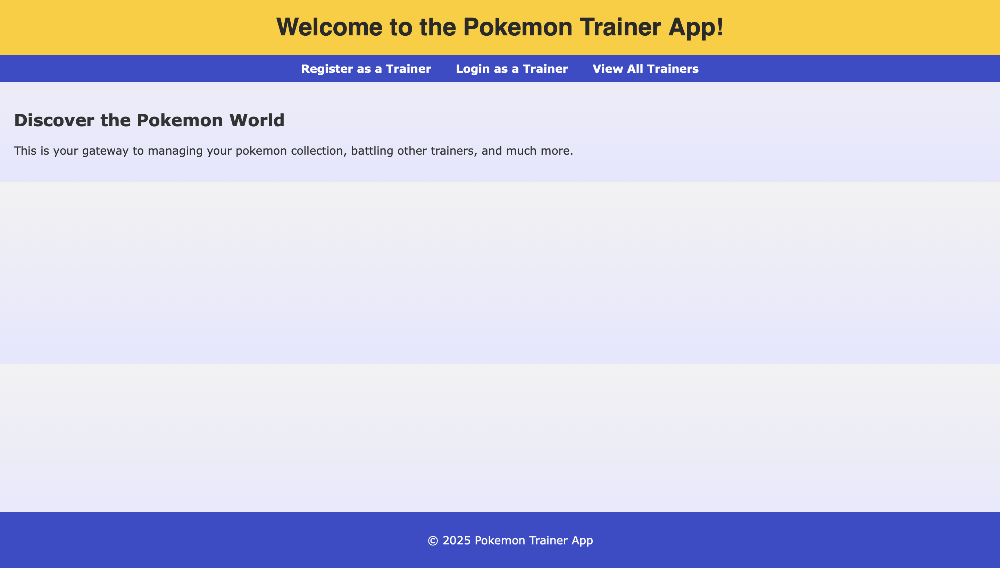
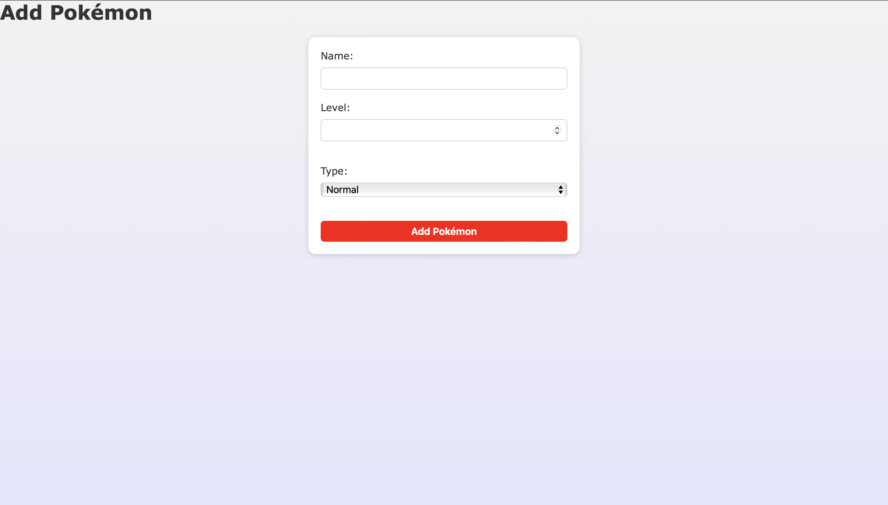
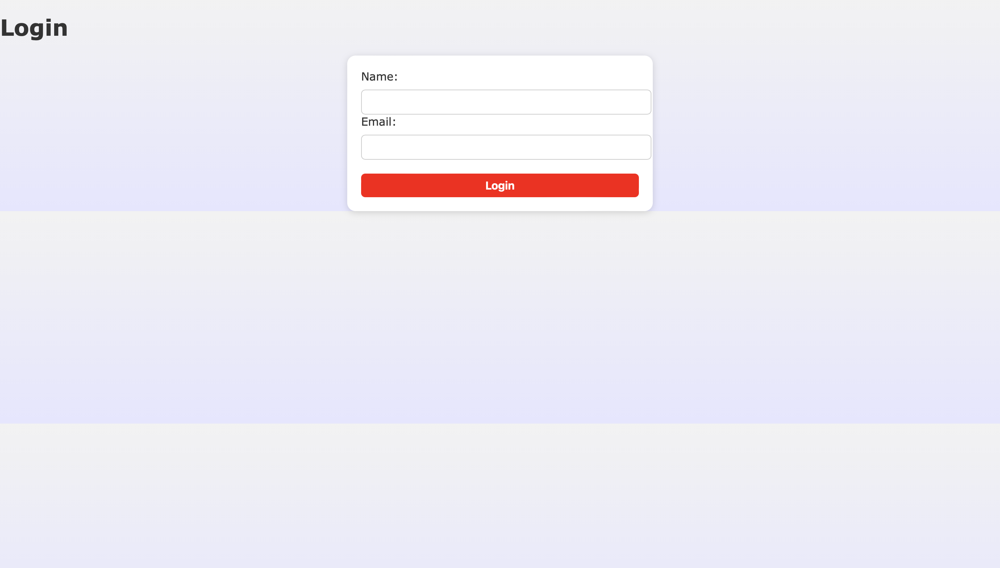

# **Inventory Application - ODIN**

## **Pokemon Trainer App**
This project is part of the Node.js unit in the Odin Project under the "Express" chapter. It is a node.js app that allows users to login and add pokemon to their list/collection.

---

## **Application Screenshots**

### **Home Page**  
  

### **Add Pokemon Form**  
  

### **Login Form**  
  

---

## **Technologies Used**
- **EJS**: Handles application logic and user interactions.
- **Node.js**: Serves as the backend runtime environment for building the server-side logic.
- **Neon PostgreSQL**: Cloud-hosted PostgreSQL database used to store and manage application data.
- **CSS**: Styles and layouts for better user experience.
- **Sequelize**: An ORM tool used to interact with the PostgreSQL database in a structured and efficient way.
- **JavaScript**: Handles frontend interactivity and enhances client-side functionality.
- **Render**: Cloud platform used to deploy and host the web application.

---

## **Features Implemented**

### **Core Requirements:**
- **Express Project and PostgreSQL:** Must use these within the project.
- **Deploy:** Deployed using Neon for the database server and Render for the web app deployment.
- **Tables:** Uses three tables (Trainer, Type, Pokemon).
- **Create Views:** Many views created using ejs.
- **Login:** Users can login and register for their "Pokemon list dashboard".

### **Additional Features I Made:**
- **Trainer List:** Allows users to see a list of trainers on the app.
- **Singular Pokemon:** There is only one specific pokemon for each trainer, so no duplicates to where two trainers can have the same pokemon. (Might change this in the future.)

---

## **Usage Guidelines**
1. Open the application by using this link: https://pokemon-trainer-app.onrender.com .
---

## **Future Improvements Planned**
- **Pokemon API:** Use the data from Pokemon API to use in app.
- **User Authentication:** Allow user to be authorized by passwords.
- **Delete Functionality:** Allow a user to delete their account or pokemon in their list.
---

## **Learning Outcomes**
- **Express Server Knowledge:** Improved understanding of how to create and set up an express server using Node JS.
- **Database Usage:** Gained experience in using a database server on Neon.
- **Understanding Sequalize:** Learned to manipulate raw SQL code by using sequlaize for cleaner and more efficient usage fo SQL functionality.
- **Deploying On Render:** Learned how to deploy an app on Render.

<!-- 
Tasks To-Do For Portfolio:
1. Use the pokemon api to have pictures and font for the app.
2. User Authentication for each user with a trainer account
3. Update the CSS

-->
